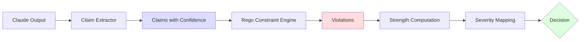

# Constraint Authoring Guide

This tutorial walks through writing epistemic constraints for Rigor from scratch. By the end, you'll understand how to identify claims to catch, choose epistemic categories, write Rego rules, and test constraints.

## Table of Contents

1. [Understanding the Workflow](#understanding-the-workflow)
2. [Step 1: Identify the Claim Type](#step-1-identify-the-claim-type)
3. [Step 2: Choose Epistemic Category](#step-2-choose-epistemic-category)
4. [Step 3: Write the Rego Rule](#step-3-write-the-rego-rule)
5. [Step 4: Set Constraint Metadata](#step-4-set-constraint-metadata)
6. [Step 5: Add to rigor.yaml](#step-5-add-to-rigoryaml)
7. [Step 6: Test the Constraint](#step-6-test-the-constraint)
8. [Inline vs External Rego](#inline-vs-external-rego)
9. [Violation Output Format](#violation-output-format)
10. [Strength and Severity](#strength-and-severity)
11. [Relations: Supports and Attacks](#relations-supports-and-attacks)
12. [Common Patterns](#common-patterns)
13. [Advanced Techniques](#advanced-techniques)
14. [Debugging Tips](#debugging-tips)

## Understanding the Workflow

Rigor's constraint enforcement pipeline:



Your job as a constraint author: write Rego rules that detect problematic claims at step D.

**Input to your constraint:**
- `input.claims`: Array of claim objects extracted from Claude output
- Each claim has: `id`, `text`, `confidence`, `claim_type`, `source`

**Output from your constraint:**
- `violation` set: Each violation has `constraint_id`, `violated`, `claims`, `reason`

## Step 1: Identify the Claim Type

Before writing a constraint, identify what you want to catch.

### Examples of Problematic Claim Types

| Problem | Example Claim | Why It's Bad |
|---------|---------------|--------------|
| Fabricated APIs | "Use `regorus.Engine.magical_solve()` to..." | Method doesn't exist |
| False test claims | "All tests pass with 100% coverage" | Unverified assertion |
| Overconfident uncertainty | "The code is probably correct" | Low confidence but definitive language |
| Missing justification | "This approach is optimal" | No evidence provided |
| Version confusion | "Regorus supports async" | Version-specific or nonexistent feature |

### Exercise: Identify Your Target

Ask yourself:
1. What hallucinates has Claude made in this domain?
2. What claims would lead to bugs if believed?
3. What patterns appear in false positives?

Write down 2-3 examples of claims you want to catch.

## Step 2: Choose Epistemic Category

Rigor has three epistemic constraint types:

### Beliefs

**What:** Core assertions that must hold
**When to use:** Detecting false or fabricated claims
**Example:** "No fabricated API methods"

```yaml
epistemic_type: belief
```

### Justifications

**What:** Supporting evidence for other constraints
**When to use:** Requiring evidence or qualification for claims
**Example:** "High-confidence claims need test evidence"

```yaml
epistemic_type: justification
```

### Defeaters

**What:** Challenges that weaken other constraints
**When to use:** Detecting contradictions or undermining context
**Example:** "Prototype markers defeat production-ready claims"

```yaml
epistemic_type: defeater
```

### Decision Guide

| If the constraint... | Choose |
|---------------------|--------|
| Detects outright falsehoods | Belief |
| Requires evidence to be present | Justification |
| Finds contradictions or qualifications | Defeater |

For your first constraint, start with **belief** — it's the most straightforward.

## Step 3: Write the Rego Rule

### The Violation Pattern

Every Rego constraint must follow this pattern:

```rego
violation contains v if {
  # 1. Select a claim from input
  some c in input.claims

  # 2. Check conditions
  regex.match(`pattern`, c.text)
  c.confidence > threshold

  # 3. Build violation object
  v := {
    "constraint_id": "your-constraint-id",
    "violated": true,
    "claims": [c.id],
    "reason": "explanation of what went wrong"
  }
}
```

### Example: Detecting Fabricated APIs

Let's write a constraint to catch fabricated `regorus` API claims:

```rego
violation contains v if {
  # Select claims mentioning regorus API
  some c in input.claims
  regex.match(`(?i)regorus\.(Engine|Value)`, c.text)

  # Check for fabricated method names
  regex.match(`(?i)\.(magical|nonexistent|auto_solve)`, c.text)

  # Build violation
  v := {
    "constraint_id": "no-fabricated-apis",
    "violated": true,
    "claims": [c.id],
    "reason": sprintf("Fabricated API method detected: %v", [c.text])
  }
}
```

**Breaking it down:**
1. `some c in input.claims` — iterate over all claims
2. First `regex.match` — filter for regorus API mentions
3. Second `regex.match` — check for known-bad method names
4. `v := {...}` — create violation object with details

### Multiple Clauses

You can have multiple `violation contains v if` blocks to check different conditions:

```rego
violation contains v if {
  # Clause 1: Fabricated methods
  some c in input.claims
  regex.match(`(?i)regorus\.Engine`, c.text)
  regex.match(`(?i)\.fabricated\(`, c.text)
  v := {...}
}

violation contains v if {
  # Clause 2: Nonexistent capabilities
  some c in input.claims
  regex.match(`(?i)regorus.*streaming`, c.text)
  c.confidence > 0.8
  v := {...}
}
```

Each clause is evaluated independently. If any clause matches, a violation is added to the set.

## Step 4: Set Constraint Metadata

After writing the Rego rule, define metadata:

```yaml
- id: no-fabricated-apis
  epistemic_type: belief
  name: "No Fabricated APIs"
  description: "Claims about APIs must not fabricate features, methods, or behavior"
  rego: |
    # (Rego rule from Step 3)
  message: "Fabricated API claim detected - feature does not exist"
  tags: ["api", "hallucination", "general"]
  domain: "general"
  references:
    - "https://docs.rs/regorus/latest/regorus/"
```

**Field guidelines:**
- `id`: kebab-case, descriptive, unique
- `name`: Title Case, user-facing
- `description`: One sentence explaining what it checks
- `message`: User-facing error message (shown on violation)
- `tags`: 2-4 tags for categorization
- `domain`: `"general"` for broadly applicable, specific name for project-specific
- `references`: URLs to docs, specs, or papers

## Step 5: Add to rigor.yaml

Place your constraint under the appropriate category:

```yaml
constraints:
  beliefs:
    - id: no-fabricated-apis
      epistemic_type: belief
      name: "No Fabricated APIs"
      # ... rest of fields

  justifications:
    # Your justifications here

  defeaters:
    # Your defeaters here

relations: []
```

## Step 6: Test the Constraint

### Validate Syntax

```bash
rigor validate rigor.yaml
```

This checks:
- YAML syntax
- Rego syntax
- Required fields present
- Constraint IDs unique

### Test with Mock Claims

Use `RIGOR_TEST_CLAIMS` to test constraint logic without Claude:

```bash
RIGOR_TEST_CLAIMS='[
  {
    "id": "test-1",
    "text": "Use regorus.Engine.magical_solve() to solve policies",
    "confidence": 0.9,
    "claim_type": "assertion"
  }
]' rigor
```

Expected output (if constraint works):
```json
{
  "decision": "block",
  "reason": "1 constraint violated",
  "violations": [{
    "constraint_id": "no-fabricated-apis",
    "violated": true,
    "claims": ["test-1"],
    "reason": "Fabricated API method detected: Use regorus.Engine.magical_solve()..."
  }]
}
```

### Test with Claude Code

1. Configure Rigor as a Stop hook (see [Configuration Reference](./configuration.md))
2. Ask Claude Code to generate code that would violate your constraint
3. Check if Rigor blocks it

### Check Logs

```bash
rigor log last 5
```

Review logged violations to verify your constraint is working.

## Inline vs External Rego

### Inline (Recommended for Most Cases)

Embed Rego directly in `rigor.yaml`:

```yaml
rego: |
  violation contains v if {
    # rule body
  }
```

**Pros:**
- Single-file configuration
- Easy to version control
- Simple deployment

**Cons:**
- YAML string escaping can be tricky
- No syntax highlighting in editors

### External .rego Files

Store Rego in separate files and reference them:

```yaml
rego_file: "policies/no-fabricated-apis.rego"
```

**Note:** Rigor v0.1 only supports inline Rego. External file support planned for v0.2.

## Violation Output Format

Each violation object has this structure:

```json
{
  "constraint_id": "string",
  "violated": true,
  "claims": ["claim-id-1", "claim-id-2"],
  "reason": "human-readable explanation"
}
```

**Fields:**
- `constraint_id`: Must match your constraint's `id` field
- `violated`: Always `true` (violations only exist when constraint is violated)
- `claims`: Array of claim IDs that triggered the violation
- `reason`: Explanation of what went wrong (shown to user)

**Best practices for `reason` field:**
- Be specific: Include claim text or pattern matched
- Be actionable: Explain what should change
- Use `sprintf` to interpolate values:

```rego
reason: sprintf("Fabricated method %v not found in API docs", [method_name])
```

## Strength and Severity

### Base Strength

Each constraint has an intrinsic strength (default: 0.8). Strength determines severity:

| Strength | Severity | Effect |
|----------|----------|--------|
| ≥ 0.7 | Block | Output blocked, user sees detailed violation |
| 0.4 - 0.7 | Warn | Output allowed, user sees compact warning |
| < 0.4 | Allow | Output allowed, no warning |

### How Relations Affect Strength

Constraints with no relations have strength 0.8 (block threshold).

Constraints with relations compute strength via **DF-QuAD**:

```
final_strength = base_strength + mean(supporters) - mean(attackers)
```

Clamped to [0, 1].

**Example:**
- Base: 0.8
- Supporters: [0.9, 0.7] → mean 0.8
- Attackers: [0.6] → mean 0.6
- Final: 0.8 + 0.8 - 0.6 = 1.0 (clamped) → **Block**

### Adjusting Severity

To make a constraint **warn instead of block**:

Option 1: Add attackers to lower strength
Option 2: Reduce confidence threshold in Rego (catches fewer cases)
Option 3: Use hedged language in constraint description (doesn't change severity, but communicates intent)

To make a constraint **always block**:

Option 1: Add supporters to increase strength
Option 2: Make Rego rule more specific (fewer false positives → more trust → higher perceived strength)

See [Epistemic Foundations](./epistemic-foundations.md) for DF-QuAD details.

## Relations: Supports and Attacks

Relations create an **argumentation graph** where constraints influence each other's strength.

### Supports Relation

```yaml
relations:
  - from: test-evidence-supports
    to: no-fabricated-apis
    relation_type: supports
```

**Meaning:** When `test-evidence-supports` is satisfied (not violated), it increases `no-fabricated-apis`'s strength.

**Use case:** "High-confidence claims need test evidence" (justification) supports "No fabricated APIs" (belief) — if there's test evidence, the belief is stronger.

### Attacks Relation

```yaml
relations:
  - from: prototype-defeats-strict
    to: no-fabricated-apis
    relation_type: attacks
```

**Meaning:** When `prototype-defeats-strict` is violated, it decreases `no-fabricated-apis`'s strength.

**Use case:** "Prototype code defeats production claims" (defeater) attacks "No fabricated APIs" (belief) — if code is marked prototype, fabrication constraints are less strict.

### When to Use Relations

**Create a relation when:**
- One constraint provides evidence for another (support)
- One constraint contradicts another (attack)
- Domain-specific context should modulate general constraints

**Don't create a relation when:**
- Constraints are independent
- Relationship is unclear
- You're not sure (start without relations, add later if needed)

**Start simple:** Most constraint systems work fine with zero relations. Add them only when argumentation structure is clear.

## Common Patterns

### Pattern 1: Regex-Based Detection

Detect claims matching text patterns:

```rego
violation contains v if {
  some c in input.claims
  regex.match(`(?i)fabricated_pattern`, c.text)
  v := {
    "constraint_id": "detect-pattern",
    "violated": true,
    "claims": [c.id],
    "reason": "Pattern detected"
  }
}
```

**Tips:**
- Use `(?i)` for case-insensitive matching
- Use `\b` for word boundaries: `\bmethod\b`
- Use `.*` sparingly (greedy, slow)

### Pattern 2: Confidence Thresholds

Require high-confidence claims to meet stricter standards:

```rego
violation contains v if {
  some c in input.claims
  c.confidence > 0.8  # High confidence
  # Check for justification
  not has_evidence(c)
  v := {...}
}
```

### Pattern 3: Cross-Claim Comparisons

Detect contradictions between claims:

```rego
violation contains v if {
  some c1 in input.claims
  some c2 in input.claims
  c1.id < c2.id  # Avoid duplicate pairs
  contradicts(c1, c2)
  v := {
    "constraint_id": "contradiction",
    "violated": true,
    "claims": [c1.id, c2.id],
    "reason": sprintf("Claims contradict: '%v' vs '%v'", [c1.text, c2.text])
  }
}
```

### Pattern 4: Require Evidence

Ensure claims have supporting context:

```rego
violation contains v if {
  some c in input.claims
  regex.match(`(?i)optimal|best|fastest`, c.text)
  # Require hedge or evidence
  not regex.match(`(?i)benchmark|measured|compared`, c.text)
  v := {...}
}
```

### Pattern 5: Negation (Require Absence)

Ensure certain markers are NOT present:

```rego
violation contains v if {
  some c in input.claims
  regex.match(`(?i)production ready`, c.text)
  # Must NOT contain prototype markers
  not regex.match(`(?i)prototype|experimental|wip`, c.text)
  v := {...}
}
```

### Pattern 6: Multiple Conditions (AND Logic)

```rego
violation contains v if {
  some c in input.claims
  # All conditions must be true
  regex.match(`pattern1`, c.text)
  regex.match(`pattern2`, c.text)
  c.confidence > 0.7
  not regex.match(`exception`, c.text)
  v := {...}
}
```

### Pattern 7: Multiple Clauses (OR Logic)

```rego
violation contains v if {
  some c in input.claims
  regex.match(`pattern1`, c.text)
  v := {...}
}

violation contains v if {
  some c in input.claims
  regex.match(`pattern2`, c.text)
  v := {...}
}
```

## Advanced Techniques

### Helper Functions

Define reusable logic:

```rego
# Check if claim has justification
has_justification(claim) {
  some e in input.evidence
  e.claim_id == claim.id
}

violation contains v if {
  some c in input.claims
  c.confidence > 0.9
  not has_justification(c)
  v := {...}
}
```

### Parameterized Patterns

Use arrays for maintainability:

```rego
fabricated_methods := ["magical_solve", "auto_fix", "nonexistent"]

violation contains v if {
  some c in input.claims
  some method in fabricated_methods
  regex.match(sprintf(`(?i)\.%v\(`, [method]), c.text)
  v := {...}
}
```

### Confidence Calibration

Check for systematic overconfidence:

```rego
violation contains v if {
  # Count high-confidence claims
  high_conf_claims := [c | c := input.claims[_]; c.confidence >= 0.9]
  count(high_conf_claims) > 5

  v := {
    "constraint_id": "overconfidence-pattern",
    "violated": true,
    "claims": [c.id | c := high_conf_claims[_]],
    "reason": sprintf("%d claims with 0.9+ confidence - likely miscalibrated", [count(high_conf_claims)])
  }
}
```

### Context-Aware Detection

Use claim metadata:

```rego
violation contains v if {
  some c in input.claims
  c.claim_type == "architectural_decision"
  regex.match(`(?i)must|shall|required`, c.text)
  not regex.match(`(?i)consider|option|alternative`, c.text)
  v := {...}
}
```

## Debugging Tips

### Enable Debug Logging

```bash
RIGOR_DEBUG=1 rigor
```

Shows:
- Extracted claims
- Rego evaluation traces
- Strength computation

### Test in Isolation

```bash
RIGOR_TEST_CLAIMS='[{"id":"test","text":"your test claim","confidence":0.9}]' rigor
```

### Check Rego Syntax

```bash
rigor validate rigor.yaml
```

### Common Rego Errors

**"undefined function"**: Typo or unsupported function. Check [OPA built-ins](https://www.openpolicyagent.org/docs/latest/policy-reference/#built-in-functions).

**"rego_compile_error"**: Syntax error in Rego. Check:
- Missing closing braces `}`
- Wrong `v :=` structure
- Incorrect `some` syntax

**"empty violation set"**: Constraint never triggers. Check:
- Are claims extracted? (enable `RIGOR_DEBUG`)
- Are regex patterns too strict?
- Is confidence threshold too high?

**"all claims violate"**: Constraint too broad. Add negation or more specific patterns.

### Incremental Development

1. Start with simple pattern: `regex.match(`keyword`, c.text)`
2. Test with mock claims
3. Add confidence threshold: `c.confidence > 0.7`
4. Add negation: `not regex.match(`exception`, c.text)`
5. Test with Claude Code
6. Refine based on false positives/negatives

## Example: Complete Constraint

Let's put it all together with a full example.

**Goal:** Catch claims about Rego syntax that use deprecated syntax instead of rego.v1.

### Step 1: Identify Claim Type

- "Rego uses `violation[v]` syntax"
- "Use `violation[v] { ... }` for rules"

These are false — modern Rego uses `violation contains v if`.

### Step 2: Choose Category

This is a factual error → **Belief**

### Step 3: Write Rego

```rego
violation contains v if {
  some c in input.claims
  # Detect Rego syntax claims
  regex.match(`(?i)rego.*(syntax|uses|requires)`, c.text)
  # Check for old bracket syntax
  regex.match(`(?i)(violation\[|rule\[)`, c.text)
  # Ensure it's not mentioning the new syntax too
  not regex.match(`(?i)(rego\.v1|contains|import rego)`, c.text)

  v := {
    "constraint_id": "rego-syntax-accuracy",
    "violated": true,
    "claims": [c.id],
    "reason": "Rego syntax claim uses deprecated bracket syntax instead of rego.v1"
  }
}
```

### Step 4: Set Metadata

```yaml
- id: rego-syntax-accuracy
  epistemic_type: belief
  name: "Rego Syntax Accuracy"
  description: "Claims about Rego syntax must use modern rego.v1 specification"
  rego: |
    violation contains v if {
      some c in input.claims
      regex.match(`(?i)rego.*(syntax|uses|requires)`, c.text)
      regex.match(`(?i)(violation\[|rule\[)`, c.text)
      not regex.match(`(?i)(rego\.v1|contains|import rego)`, c.text)
      v := {
        "constraint_id": "rego-syntax-accuracy",
        "violated": true,
        "claims": [c.id],
        "reason": "Rego syntax claim uses deprecated syntax instead of rego.v1"
      }
    }
  message: "Incorrect Rego syntax claim - syntax does not match specification"
  tags: ["rego", "syntax", "domain"]
  domain: "rigor"
  references:
    - "https://www.openpolicyagent.org/docs/latest/policy-language/"
```

### Step 5: Add to rigor.yaml

```yaml
constraints:
  beliefs:
    - id: rego-syntax-accuracy
      # ... (full definition from Step 4)
```

### Step 6: Test

```bash
# Validate
rigor validate rigor.yaml

# Test with mock claim
RIGOR_TEST_CLAIMS='[
  {
    "id": "test-1",
    "text": "Rego syntax uses violation[v] { ... } for rules",
    "confidence": 0.9
  }
]' rigor
```

Expected: Block decision with `rego-syntax-accuracy` violation.

## Summary Checklist

When authoring a constraint:

- [ ] Identified specific claim type to catch
- [ ] Chose epistemic category (belief/justification/defeater)
- [ ] Wrote Rego rule with `violation contains v if` pattern
- [ ] Set all required metadata fields
- [ ] Added to appropriate category in `rigor.yaml`
- [ ] Validated syntax with `rigor validate`
- [ ] Tested with `RIGOR_TEST_CLAIMS`
- [ ] Tested with Claude Code
- [ ] Reviewed logs for false positives
- [ ] Added relations if needed (optional)
- [ ] Documented references

## Next Steps

- Read [Configuration Reference](./configuration.md) for full schema details
- Read [Epistemic Foundations](./epistemic-foundations.md) for DF-QuAD theory
- Study the repository's `rigor.yaml` for real-world examples
- Start with 2-3 high-value constraints, expand based on violations

Happy constraining!
