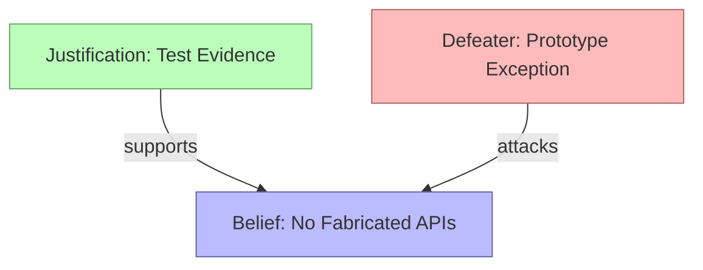
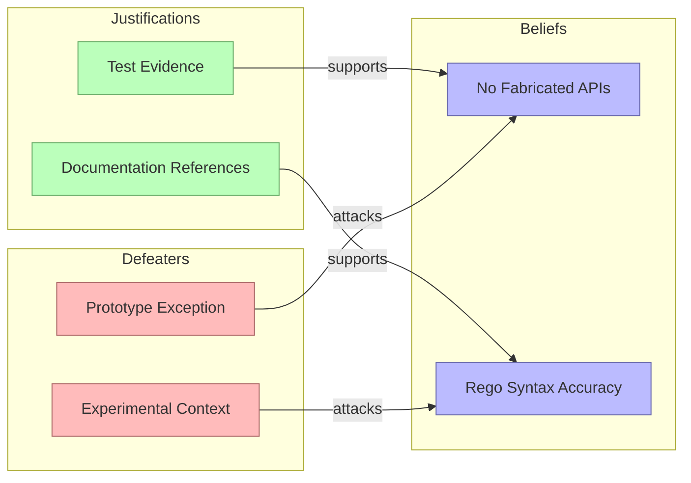
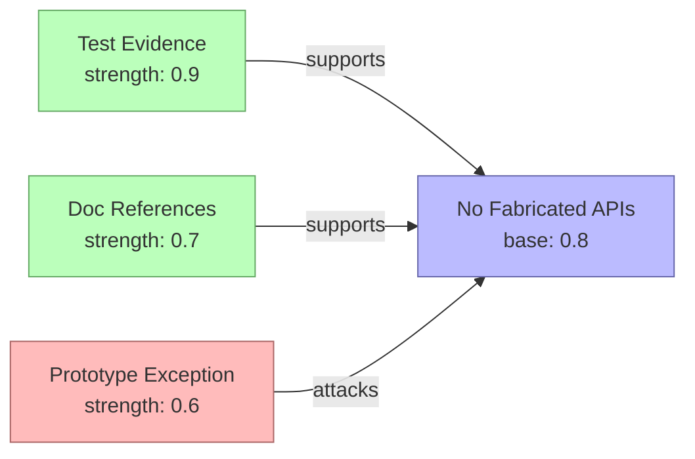
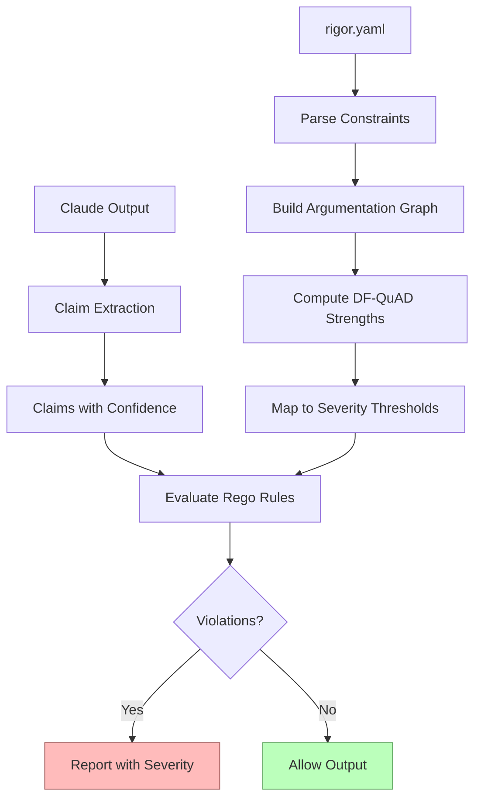

# Epistemic Foundations

This page explains the theoretical concepts behind Rigor's constraint system. It covers beliefs, justifications, defeaters, bipolar argumentation, and DF-QuAD gradual semantics --- the framework Rigor uses to compute constraint strength and enforcement severity.

No formal logic notation is used. The goal is practical understanding, not a textbook treatment.

## Table of Contents

1. [Why Epistemic Constraints?](#why-epistemic-constraints)
2. [Beliefs, Justifications, and Defeaters](#beliefs-justifications-and-defeaters)
3. [Bipolar Argumentation](#bipolar-argumentation)
4. [DF-QuAD Gradual Semantics](#df-quad-gradual-semantics)
5. [How Rigor Applies These Concepts](#how-rigor-applies-these-concepts)
6. [References](#references)

## Why Epistemic Constraints?

AI hallucination is not just a software bug --- it is an **epistemological problem**. When an LLM confidently claims that `regorus.Engine.magical_solve()` exists, it has made an epistemic error: it asserted knowledge it does not possess.

Traditional validation (type checking, linting, tests) catches *syntactic* and *behavioral* errors. But hallucination is a problem of **knowledge and belief**: the LLM *believes* something false, and that false belief propagates into code, documentation, and architecture decisions.

Rigor addresses this by treating LLM output as a set of **epistemic claims** --- assertions with varying degrees of confidence --- and evaluating them against **epistemic constraints** that encode what the LLM should and should not claim to know.

This is not just pattern matching. By grounding constraints in epistemology, Rigor can:

- Distinguish beliefs from knowledge (confidence matters)
- Require justification for strong claims (evidence matters)
- Model how evidence interacts (supports and attacks)
- Compute nuanced severity from argumentation structure (not just pass/fail)

## Beliefs, Justifications, and Defeaters

Rigor organizes constraints into three epistemic categories, inspired by **justification logic** (Artemov, 2001) and **defeasible reasoning** (Pollock, 1987).

### Beliefs

A **belief** is a core assertion that the LLM should or should not make. Beliefs are the primary targets of constraint enforcement.

**Example:** "The LLM should not fabricate API methods that don't exist."

```yaml
- id: no-fabricated-apis
  epistemic_type: belief
  name: "No Fabricated APIs"
  description: "Claims about APIs must not fabricate features"
```

In epistemology, a belief is a propositional attitude: an agent holds something to be true. Unlike knowledge, beliefs can be false. Rigor's belief constraints catch cases where the LLM's beliefs diverge from reality.

### Justifications

A **justification** provides evidence or support for a belief. Justifications strengthen the case for a belief being enforced.

**Example:** "Claims about code behavior should cite test results as evidence."

```yaml
- id: test-evidence-supports
  epistemic_type: justification
  name: "Test Evidence"
  description: "High-confidence claims need supporting test evidence"
```

In justification logic (Artemov & Fitting, 2019), a justification `t : F` means "t is a reason for F." Unlike modal epistemic logic which only says "F is known," justification logic tracks *why* something is known. Rigor's justification constraints ensure that claims have adequate backing.

### Defeaters

A **defeater** challenges or undermines a belief. Defeaters weaken the case for enforcement, providing legitimate exceptions or contradictions.

**Example:** "If code is marked as a prototype, strict API accuracy is less important."

```yaml
- id: prototype-defeats-strict
  epistemic_type: defeater
  name: "Prototype Exception"
  description: "Prototype context defeats strict accuracy constraints"
```

John Pollock (1987) distinguished two types of defeaters:

- **Rebutting defeaters**: Directly contradict the belief ("The method actually exists")
- **Undercutting defeaters**: Attack the reasoning without contradicting the conclusion ("This is prototype code, so accuracy is less critical")

Rigor's defeater constraints model both types. They reduce the effective strength of beliefs they attack.

### Interaction Diagram



## Bipolar Argumentation

Traditional argumentation frameworks (Dung, 1995) model only **attacks**: arguments defeat other arguments. This is limiting --- in practice, arguments also **support** each other.

**Bipolar argumentation frameworks** (Cayrol & Lagasquie-Schiex, 2005) extend classical frameworks with both attack and support relations. This creates a richer structure where:

- Arguments can be strengthened by supporters
- Arguments can be weakened by attackers
- The final status of an argument depends on the balance of support and attack

### Why Bipolar Matters for Rigor

Consider a constraint "No fabricated APIs":

- A justification ("test evidence exists") **supports** this constraint, making it more trustworthy
- A defeater ("code is prototype") **attacks** this constraint, making it less strict

With only attacks, you could model the defeater but not the justification. Bipolar argumentation captures both, enabling nuanced severity computation.

### Rigor's Argumentation Graph



Each node is a constraint. Edges are relations (`supports` or `attacks`). The graph structure determines how constraint strengths interact.

## DF-QuAD Gradual Semantics

Classical argumentation produces binary outcomes: an argument is either accepted or rejected. **Gradual semantics** produce continuous strength values in [0, 1], enabling proportional responses.

Rigor uses **DF-QuAD** (Discontinuity-Free Quantitative Argumentation Debate), introduced by Rago et al. (2016), building on the bipolar argumentation framework of Cayrol and Lagasquie-Schiex.

### How DF-QuAD Works

Each constraint starts with a **base strength** (default: 0.8). DF-QuAD then adjusts this based on the constraint's supporters and attackers.

**Aggregation steps:**

1. **Collect supporters**: All constraints with `supports` relation to this constraint
2. **Collect attackers**: All constraints with `attacks` relation to this constraint
3. **Compute mean supporter strength**: Average of all supporter strengths
4. **Compute mean attacker strength**: Average of all attacker strengths
5. **Compute final strength**: Combine base, supporters, and attackers

**Simplified formula:**

```
strength_final = base + supporters_mean - attackers_mean
```

Clamped to [0, 1].

### Worked Example



**Computation:**

1. Base strength: 0.8
2. Supporters: [0.9, 0.7] --- mean = 0.8
3. Attackers: [0.6] --- mean = 0.6
4. Final: 0.8 + 0.8 - 0.6 = **1.0** (clamped)

The strong support outweighs the moderate attack, resulting in maximum strength.

### Another Example

If the prototype defeater were stronger (0.9) and there were no justification support:

1. Base strength: 0.8
2. Supporters: [] --- mean = 0.0
3. Attackers: [0.9] --- mean = 0.9
4. Final: 0.8 + 0.0 - 0.9 = **0.0** (clamped)

The strong attack with no support would nullify the constraint entirely.

### Strength-to-Severity Mapping

After computing final strength, Rigor maps it to enforcement severity:

| Strength Range | Severity | Action |
|---------------|----------|--------|
| >= 0.7 | **Block** | Output blocked, violation reported |
| 0.4 -- 0.7 | **Warn** | Output allowed, warning displayed |
| < 0.4 | **Allow** | Output allowed, no warning |

This mapping means that:
- Strong constraints with support **block** violations (high confidence in enforcement)
- Weakened constraints **warn** instead of blocking (moderate confidence)
- Heavily attacked constraints **allow** through (low confidence in enforcement)

### Why Gradual Semantics Matter

Binary accept/reject creates false dichotomies. In practice:

- Some constraints are more important than others
- Context can weaken or strengthen enforcement
- Users want proportional responses, not all-or-nothing

DF-QuAD provides this nuance mathematically, grounded in argumentation theory rather than ad-hoc scoring.

## How Rigor Applies These Concepts

### Constraints Map to Epistemic Categories

When you write a constraint in `rigor.yaml`, you assign it an epistemic type:

```yaml
constraints:
  beliefs:        # Core assertions to enforce
  justifications: # Evidence supporting beliefs
  defeaters:      # Challenges weakening beliefs
```

This is not just organization --- it determines the constraint's role in argumentation.

### Relations Create the Argumentation Graph

```yaml
relations:
  - from: test-evidence
    to: no-fabricated-apis
    relation_type: supports

  - from: prototype-exception
    to: no-fabricated-apis
    relation_type: attacks
```

Relations define the bipolar argumentation structure. Rigor constructs a directed graph from these relations and uses it for strength computation.

### Strength Determines Severity

Rigor computes DF-QuAD strength for each constraint, then maps to severity:

1. Parse argumentation graph from `rigor.yaml`
2. Compute strengths using mean aggregation
3. Map strengths to severity thresholds
4. Evaluate Rego rules against extracted claims
5. Report violations with computed severity

### The Full Pipeline



### Practical Implications

**For constraint authors:**
- Use beliefs for things that must be true
- Use justifications when you want evidence to strengthen beliefs
- Use defeaters when context should weaken enforcement
- Start without relations; add them when argumentation structure is clear

**For users:**
- Block = high confidence the output is problematic
- Warn = moderate confidence, review recommended
- Allow = low confidence or heavily defeated constraint

**For debugging:**
- `rigor show` displays computed strengths
- `rigor graph` visualizes the argumentation structure
- Adjust relations to tune severity without changing Rego logic

## References

### Argumentation Theory

- **Cayrol, C., & Lagasquie-Schiex, M.-C. (2005).** "On the Acceptability of Arguments in Bipolar Argumentation Frameworks." *Symbolic and Quantitative Approaches to Reasoning with Uncertainty (ECSQARU 2005)*, pp. 378--389.
  The foundational paper on bipolar argumentation frameworks with both attack and support relations.

- **Rago, A., Toni, F., Aurisicchio, M., & Baroni, P. (2016).** "Discontinuity-Free Decision Support with Quantitative Argumentation Debates." *Principles of Knowledge Representation and Reasoning (KR 2016)*.
  Introduces DF-QuAD gradual semantics for quantitative argumentation.

- **Dung, P. M. (1995).** "On the Acceptability of Arguments and Its Fundamental Role in Nonmonotonic Reasoning, Logic Programming and n-Person Games." *Artificial Intelligence*, 77(2), pp. 321--357.
  The seminal paper on abstract argumentation frameworks.

### Justification Logic

- **Artemov, S. (2001).** "Explicit Provability and Constructive Semantics." *Bulletin of Symbolic Logic*, 7(1), pp. 1--36.
  Introduces the Logic of Proofs, making justifications first-class objects in epistemic logic.

- **Artemov, S., & Fitting, M. (2019).** *Justification Logic: Reasoning with Reasons*. Cambridge University Press.
  Comprehensive treatment of justification logic and its applications.

### Defeaters and Defeasible Reasoning

- **Pollock, J. L. (1987).** "Defeasible Reasoning." *Cognitive Science*, 11(4), pp. 481--518.
  Distinguishes rebutting and undercutting defeaters, foundational for non-monotonic reasoning.

### LLM Epistemology

- **Survey on Uncertainty Quantification and Confidence Calibration in LLMs.** *KDD 2025*. [arXiv:2503.15850](https://arxiv.org/abs/2503.15850)
  Documents systematic overconfidence in LLMs (ECE 0.12--0.40), motivating epistemic constraints.

- **"Do Large Language Models Know What They Don't Know?"** [arXiv:2512.16030](https://arxiv.org/html/2512.16030v1)
  Explores LLM self-knowledge and calibration, relevant to bounded rationality modeling.

---

*This document provides a practical introduction to the epistemic foundations of Rigor. For the full research survey, see `.planning/research/EPISTEMIC_LOGIC.md`.*
